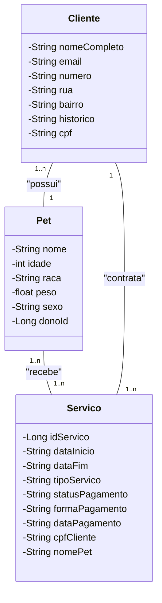

# API gestao de servicos

##Diagrama de classes

```mermaid
classDiagram
    class Cliente {
        -String nomeCompleto
        -String email
        -String numero
        -String rua
        -String bairro
        -String historico
        -String cpf
    }

    class Pet {
        -String nome
        -int idade
        -String raca
        -float peso
        -String sexo
        -Long donoId
    }

    class Servico {
        -Long idServico
        -String dataInicio
        -String dataFim
        -String tipoServico
        -String statusPagamento
        -String formaPagamento
        -String dataPagamento
        -String cpfCliente
        -String nomePet
    }

    Cliente "1..n" -- "1" Pet : "possui"
    Pet "1..n" -- "1..n" Servico : "recebe"
    Cliente "1" -- "1..n" Servico : "contrata"

```