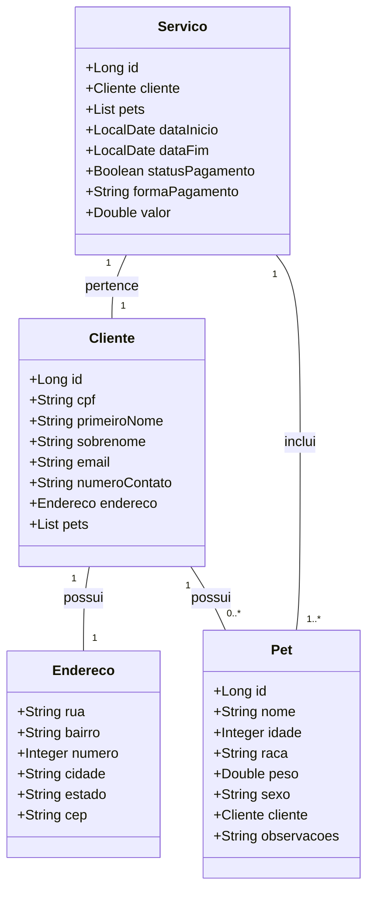

# API gestao de servicos

##Diagrama de classes

##Cardinalidades

-Cliente "1" -- "1" Endereco → Um cliente tem um endereço. 
-Cliente "1" -- "0..*" Pet → Um cliente pode ter vários pets, mas um pet pertence a apenas um cliente. 
-Servico "1" -- "1" Cliente → Um serviço pertence a um único cliente. 
-Servico "1" -- "1..*" Pet → Um serviço pode incluir um ou mais pets. 